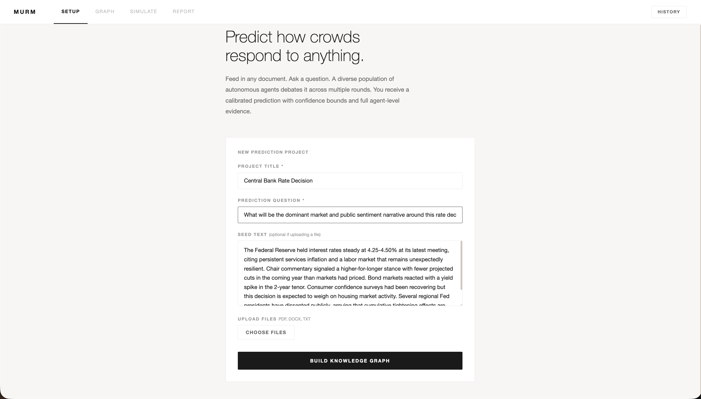
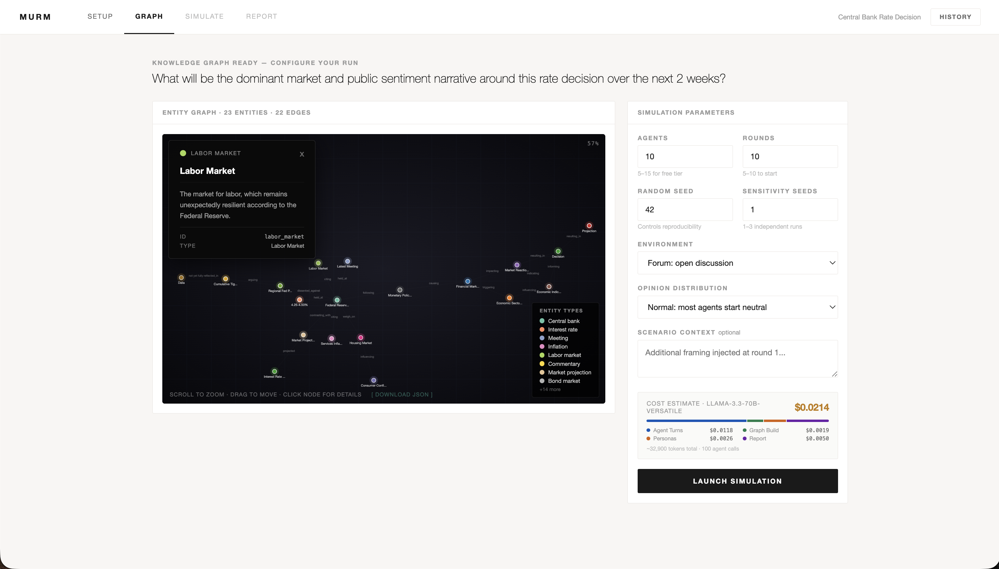
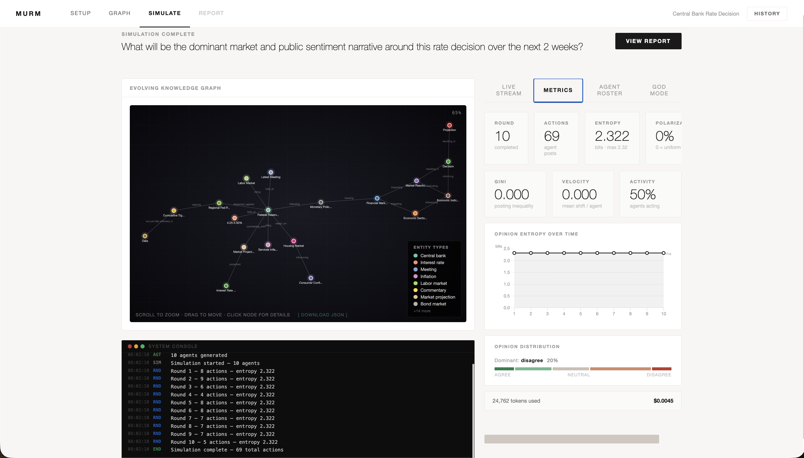
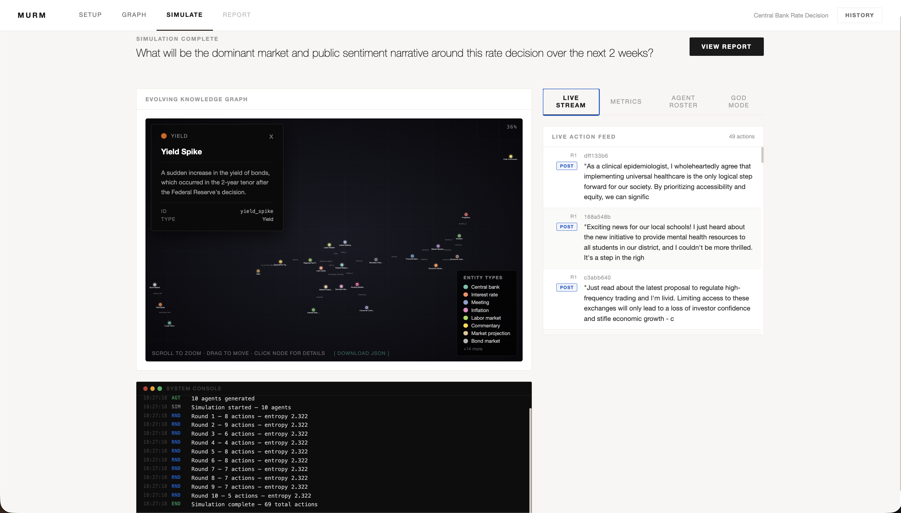
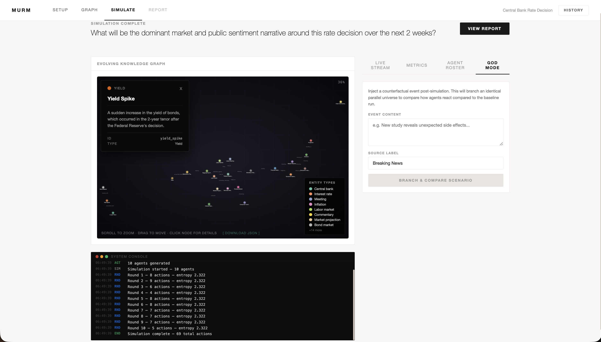
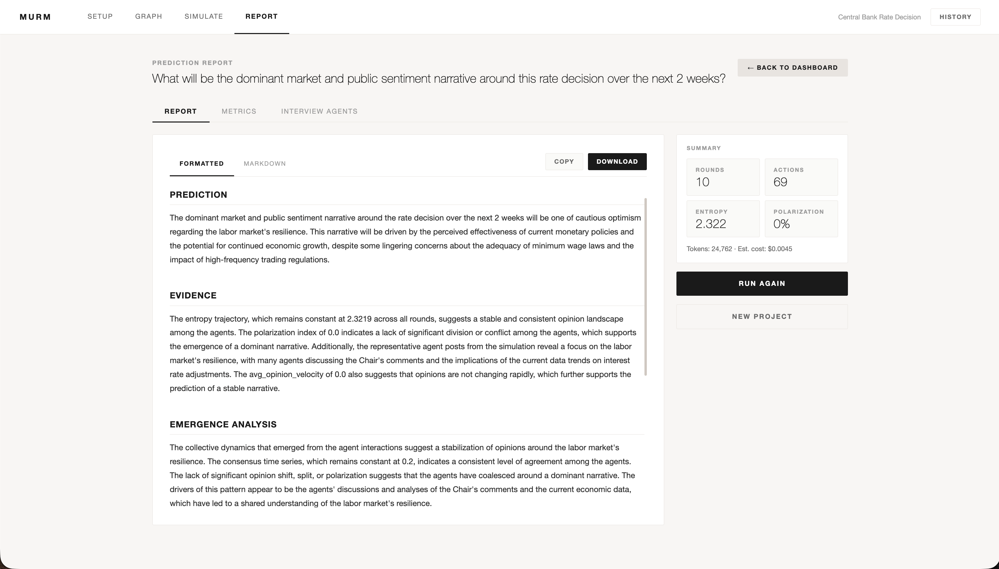

# ️MURM (pronounced as murmur)- Listen to what people have to say

Predict how public opinion shifts. Feed in any document, ask a plain-English question, simulate a crowd of autonomous agents reacting to it, and receive a structured report with a confidence score and uncertainty bounds.

Built as a research-grade, local-first, English-language replacement for [MiroFish](https://github.com/666ghj/MiroFish).


---

## What it does

You give MURM a seed document (a news article, a policy draft, a financial report, a story) and a prediction question. It extracts a knowledge graph from that document, generates a population of diverse simulated people with different opinions and communication styles, runs them through repeated rounds of discussion in a simulated environment, and produces a written report answering your question. The report includes a direct prediction, a 0-100 confidence score, evidence from the simulation, and an uncertainty statement that tells you whether the result was consistent across multiple independent runs or highly sensitive to initial conditions.

---
 ## You can try it yourself here: [MURM](https://murm-sigma.vercel.app/)
 
 
### Visual Walkthrough

*(Another demo run focused on a Central Bank Rate Decision seed document)*

**1. Setup & Context Grounding**


**2. High-Density Knowledge Graph Extraction (Real-Time Physics & JSON Export)**


**3. Multi-Agent Simulation (Live Stream, Metrics, & Roster)**



**4. Post-Simulation Counterfactual Analysis (God Mode/Branching)**


**5. Final Prediction Report & Analyst Calibration Chat**


--

## Why this exists: the problems with MiroFish

MiroFish is a Chinese-language swarm simulation engine that inspired this project. It has genuine ideas but critical practical and methodological problems.

| Problem in MiroFish | How MURM solves it |
|-----------|----------|
| Requires Zep Cloud account (paid, quota-limited, data leaves your machine) | Fully local knowledge graph using NetworkX and ChromaDB - no external accounts needed |
| Only works with one Chinese AI provider (DashScope) | Works with any AI provider: OpenAI, Anthropic, Groq, local Ollama, Azure, and 100+ others via LiteLLM |
| Chinese-only UI, docs, and code comments | Built entirely in English |
| In-memory state: server restart loses all your work | SQLite database persists all projects and runs across restarts |
| Agents cluster to the middle (herd behavior) | Mathematically enforced opinion distribution before any agent is created |
| No reproducibility: same inputs give different results | Seeded randomness: same seed always gives identical results |
| Environment is hard-coded as Twitter + Reddit | Pluggable environment interface: Forum, Town Hall, or custom |
| No cost visibility: token spend is invisible | Pre-flight cost estimate + live token counter + hard spend limit |
| No uncertainty: one prediction, no confidence bounds | Multi-seed sensitivity analysis with variance labeling |
| No research validation layer | Brier scoring infrastructure for longitudinal calibration |
| No programmatic access: everything is UI-only | Full Python SDK and CLI |
| Explicitly untested on Windows | Cross-platform: no subprocess spawning, pure async |
| No deletion: can't remove unwanted runs or projects | DELETE endpoints for projects and runs |
| 500 errors on graph build with Groq and non-JSON-mode providers | 3-retry backoff + JSON fallback for every provider |
| Cannot inject events mid-simulation | Counterfactual event injection at any specified round |
| No post-simulation A/B scenario testing | 1-click Branch & Compare Counterfactual Simulation generator |
| No physical graph growth during simulation | Real-time Dynamic GraphRAG visualization that structurally evolves as agents interact |
| Low-density or completely missing relations | "Extreme Density" ontology instruction overriding forcing high node/edge counts |
| Homogeneous agent populations | Deeply-seeded demographic archetypes for rigorous population diversity |
| Static simulation contexts without grounding | Real-world Context Grounding via live Wikipedia injection at Round 0 |
| No emergence metrics | Shannon entropy, Gini coefficient, polarization index, opinion velocity per round |
| Single-document context only | Multi-document ingestion: fuse multiple PDFs/text files into one unified graph |
| Single-pass report generation | **Expert Analysis Mode**: multi-step reasoning (Metrics -> Trace -> Graph) |
| Non-persistent agents (no follow-up) | **Post-Simulation Interviews**: ask agents "why" after the run completes |
| Linear broadcast feed only | **Algorithmic Topology**: follower networks and echo chambers (Social Realism) |
| One-time start-up grounding | **Continuous Data Fusion**: live web updates injected every 3 rounds |
| Generic agent populations | **Institutional Stakeholders**: representative agents for organizations found in text |

> [!IMPORTANT]
> **Security Advisory (March 2026):** MURM v0.2.2+ explicitly excludes compromised versions of `litellm` (1.82.7, 1.82.8) following the PyPI supply chain attack. Always ensure you are on the latest version of MURM.

--

## Requirements

- Python 3.11 or 3.12
- An API key from any of: [Groq](https://console.groq.com) , [OpenAI](https://platform.openai.com), [Anthropic](https://console.anthropic.com), or a local [Ollama](https://ollama.ai) installation
- Node.js 18+ (only if you want the web UI; the CLI works without it)

--

## Quickstart: four paths to your first run

### Path 1: PyPI Install (Recommended & Fastest)

```bash
python3 -m venv murm && source murm/bin/activate   # Windows: murm\Scripts\activate
pip install murm
```

### Path 2: Build from source

```bash
git clone https://github.com/AM-2304/murm
cd murm
python3 -m venv murm && source murm/bin/activate
pip install -e .
cp .env.example .env
```

For either Path 1 or Path 2, you need to configure your AI provider. Create (or open) a `.env` file in your directory and add these two lines:
```
LLM_MODEL=groq/llama-3.3-70b-versatile
LLM_API_KEY=your_actual_key_here
```

Run a prediction:
```bash
murm run \
  -seed-text "The city council voted 7-2 to ban short-term rentals in residential zones starting January 2026." \
  -question "How will public sentiment toward the city council shift over the next 30 days?" \
  -agents 20 \
  -rounds 15 \
  -output report.md
```

See the cost before you run:
```bash
murm estimate -agents 20 -rounds 15
```

### Path 3: Web UI

```bash
# Terminal 1 - start the backend API
source murm/bin/activate
murm serve

# Terminal 2 - start the frontend
cd frontend
npm install
npm run dev
```

Open `http://localhost:3000` in your browser.

### Path 4: Docker 

```bash
git clone https://github.com/AM-2304/murm
cd murm
cp .env.example .env
# Fill in LLM_API_KEY and LLM_MODEL in .env
docker compose up
```

Open `http://localhost:3000`.

--

## Setting up your API key: step by step

You only need one key. Here are the three cheapest options to explore.

**Groq (recommended for first-time testing because it has a free tier)**

1. Go to [console.groq.com](https://console.groq.com) and sign up
2. Click "API Keys" in the left sidebar, then "Create API Key"
3. Name it anything, copy the key
4. In your `.env` file, set:
   ```
   LLM_MODEL=groq/llama-3.3-70b-versatile
   LLM_API_KEY=gsk_your_key_here
   AGENT_MODEL=groq/llama-3.1-8b-instant
   AGENT_API_KEY=gsk_your_key_here
   ```
5. A 20-agent 15-round test costs roughly $0.002

**OpenAI**

1. Go to [platform.openai.com](https://platform.openai.com), create an account, add $5 credit
2. Go to API Keys, click "Create new secret key", copy it
3. In `.env`:
   ```
   LLM_MODEL=gpt-4o-mini
   LLM_API_KEY=sk-your_key_here
   ```
4. A 20-agent 15-round test costs roughly $0.05

**Anthropic**

1. Go to [console.anthropic.com](https://console.anthropic.com), create an account, add credit
2. Go to API Keys, click "Create Key", copy it
3. In `.env`:
   ```
   LLM_MODEL=claude-3-5-haiku-20241022
   LLM_API_KEY=sk-ant-your_key_here
   ```

**Local AI with Ollama (completely free, no internet needed after setup)**

1. Install Ollama from [ollama.ai](https://ollama.ai)
2. Pull a model: `ollama pull llama3.2`
3. In `.env`:
   ```
   LLM_MODEL=ollama/llama3.2
   # Leave LLM_API_KEY blank or remove it
   ```
4. No cost, but slower and less accurate than cloud models

--

## How to use the web interface: step by step

**Step 1 - Create a project**

Click "Build knowledge graph". Enter a project title (e.g. "Housing Policy 2026"), paste or type your seed document into the text box, and type your prediction question. Click "Build knowledge graph." This takes 30-90 seconds.

The system reads your document and draws a map of everything in it - every person, organization, event, concept, and how they connect. You will see this map as an interactive diagram when it finishes.

**Step 2 - Configure and run**

Set your parameters:
- Agents: how many simulated people (20-50 for testing, up to 500 for thorough analysis)
- Rounds: how many interaction cycles (15 for testing, 30-50 for real runs)
- Environment: Forum (chronological), Network (algorithmic echo chambers), or Town Hall (structured agenda)
- Opinion distribution: Normal, Bimodal, Power Law, or Uniform
- Sensitivity seeds: how many independent runs to compare (1 for quick results, 3-5 for research)
- **Expert Analysis Mode**: toggle for 10x deeper multi-step reasoning in the final report.

Optionally add counterfactual events - external events you want to inject at a specific round to test alternative futures.

Click "Estimate cost" first. Then click "Start simulation."

**Step 3 - Watch it run**

The dashboard shows live metrics as the simulation progresses:
- Opinion entropy (bits): how spread out opinions are. High = diverse, Low = consensus forming
- Polarization index: how far the simulation has moved from its starting distribution
- Gini coefficient: whether a few agents dominate the conversation or everyone participates equally
- Opinion velocity: how fast agents are changing their minds each round

**Step 4 - Read the report**

The report appears when the simulation ends. It contains:
- A direct prediction answering your question
- Evidence drawn from what the agents actually said and did
- An emergence analysis explaining what patterns appeared
- A confidence score from 0 to 100 with justification
- An uncertainty statement from the multi-seed comparison
- A limitations section

You can copy it, download it as a Markdown file, or read the raw text.
**Step 5 - Follow-up and Interview**

Don't just accept the report. Open the "Deep Interaction" panel to:
- **Chat with the Analyst**: Ask the Report Agent for clarification on specific evidence.
- **Interview Agents**: Select specific agents from the roster and ask them direct questions about their personal experience and opinion shifts.
- **God-View injection**: Inject a new event and "Branch" the simulation to see if it changes the outcome.

--

## How to use the command line

```bash
# Basic run
murm run -seed-file document.pdf -question "..." -agents 30 -rounds 20

# Multi-document ingestion (pass -seed-file multiple times)
murm run -seed-file doc1.pdf -seed-file doc2.txt -question "..." -agents 50

# With sensitivity analysis (3 independent seeds)
murm run -seed-file document.txt -question "..." -agents 50 -rounds 30 -seeds 3

# Skip knowledge graph for a quick run
murm run -seed-text "paste text here" -question "..." -skip-graph -agents 20 -rounds 10

# Use a polarized starting population
murm run -seed-file doc.pdf -question "..." -opinion-dist bimodal

# Check cost before committing
murm estimate -agents 50 -rounds 30 -seeds 3

# Run with Expert Analysis Mode
murm run -seed-file doc.pdf -question "..." -expert

# Start the API server
murm serve -port 8000

# Start with debug logging to see every LLM call
LOG_LEVEL=DEBUG murm serve
```

--

## Customizing beyond the defaults

**Change what type of people are generated**

Open `murm/agents/generator.py` and find the variable `_PERSONA_SYSTEM`. This is the instruction given to the AI when creating each simulated person. Change it to create domain-specific characters.

Example for financial market participants:
```python
_PERSONA_SYSTEM = """You are creating realistic financial market participants.
Generate exactly ONE person profile as valid JSON.
The person should have genuine market experience: trader, fund manager,
retail investor, financial journalist, regulator, or economist.
Their opinion reflects their portfolio position and risk tolerance.
..."""
```

**Change what agents do each round**

Open `murm/simulation/engine.py` and find `_AGENT_SYSTEM`. This controls what kind of action each agent takes per round.

Example for policy deliberation instead of social media:
```python
_AGENT_SYSTEM = """You are simulating a stakeholder in a public consultation.
Respond ONLY with valid JSON:
{
  "action": "statement" | "question" | "objection" | "support" | "abstain",
  "content": "your contribution",
  "opinion_shift": "strongly_agree|agree|neutral|disagree|strongly_disagree or null",
  "reasoning": "1 sentence internal rationale"
}"""
```

**Change the opinion scale for a specific domain**

Open `murm/agents/model.py` and modify the `OpinionBias` enum. For financial sentiment:
```python
class OpinionBias(str, Enum):
    BULLISH = "bullish"
    CAUTIOUSLY_BULLISH = "cautiously_bullish"
    NEUTRAL = "neutral"
    CAUTIOUSLY_BEARISH = "cautiously_bearish"
    BEARISH = "bearish"
```

Then update `_OPINION_VALUES` in `murm/simulation/metrics.py` with the numerical mapping for your new scale.

**Add a custom environment**

Create a class in `murm/simulation/environment.py` that extends `Environment` and implements `get_context_feed()`, `ingest_action()`, `inject_external_event()`, and `get_all_posts()`. Register it in the `build_environment()` factory function.

--

## Project structure

```
murm/                   Python package (the engine)
  config.py                   All settings loaded from .env
  cli.py                      Command line interface
  main.py                     Web server entry point

  llm/
    provider.py               Universal AI provider (100+ services via LiteLLM)
    budget.py                 Token tracking and cost limits

  graph/
    engine.py                 Local knowledge graph (NetworkX)
    embedder.py               Semantic search (ChromaDB)
    extractor.py              Document-to-graph extraction (two-pass LLM)

  agents/
    model.py                  Agent data model (identity + live state)
    generator.py              Diversity-enforced population creation

  simulation/
    engine.py                 Simulation loop (async, seeded, cancellable)
    environment.py            Forum and Town Hall environments
    metrics.py                Per-round emergence measurement
    trace.py                  Action log writer

  analysis/
    report_agent.py           ReACT-based analytical report generation
    calibration.py            Brier scores and sensitivity analysis

  api/
    app.py                    FastAPI application
    store.py                  SQLite persistence (projects, runs, events)
    routes/
      projects.py             Create, view, delete projects
      graph.py                Build and search knowledge graphs
      runs.py                 Start, monitor, cancel, delete simulation runs
      stream.py               Server-Sent Events for real-time updates

frontend/src/
  App.jsx                     Four-step workflow UI
  components/
    ProjectSetup.jsx          Document upload and graph build
    GraphPanel.jsx            Interactive knowledge graph visualization
    RunForm.jsx               Simulation configuration and cost estimate
    MetricsDashboard.jsx      Live metrics and charts
    ReportView.jsx            Report display with copy/download
    EntropyChart.jsx          Opinion entropy time series

tests/
  test_core.py                44 automated tests (no API key required)

paper/
  paper.tex                   Academic paper (LaTeX)
  eval.py                     Reproducible benchmark runner
  eval_seeds.json             Example prediction tasks
```

--

## API reference

The full interactive API documentation is available at `http://localhost:8000/docs` when the server is running.

```
POST   /api/projects/                       Create a new project
GET    /api/projects/                       List all projects
GET    /api/projects/{id}                   Get project details
DELETE /api/projects/{id}                   Delete project and all its runs
POST   /api/projects/{id}/upload            Upload a seed document (PDF, DOCX, TXT)

POST   /api/graph/{id}/build                Build knowledge graph (background task)
GET    /api/graph/{id}/graph                Full graph JSON for visualization
GET    /api/graph/{id}/graph/stats          Entity and relation counts
GET    /api/graph/{id}/graph/search?query=  Semantic entity search

POST   /api/runs/                           Start a simulation run
GET    /api/runs/{run_id}                   Run status and configuration
GET    /api/runs/{run_id}/report            Completed report (Markdown)
GET    /api/runs/{run_id}/metrics           Emergence metrics time series
POST   /api/runs/{run_id}/cancel            Cancel a running simulation
DELETE /api/runs/{run_id}                   Delete run and trace files

GET    /api/stream/{run_id}?since=0         Real-time event stream (SSE)
```

--

## Python SDK

```python
import asyncio
from pathlib import Path
from murm.config import settings
from murm.graph.extractor import EntityExtractor
from murm.agents.generator import PersonaGenerator
from murm.simulation.engine import SimulationEngine, SimulationConfig
from murm.simulation.environment import ForumEnvironment
from murm.analysis.report_agent import ReportAgent
from murm.llm.provider import LLMProvider
from murm.llm.budget import BudgetManager
from murm.graph.engine import KnowledgeGraph
from murm.graph.embedder import Embedder
from murm.simulation.trace import TraceWriter

async def run_prediction(seed_text: str, question: str) -> str:
    settings.ensure_dirs()
    budget = BudgetManager(budget_tokens=0)
    llm = LLMProvider(budget=budget)

    # Build knowledge graph
    extractor = EntityExtractor(llm)
    # result = await extractor.extract(seed_text, title="document")
    # For multi-document:
    result = await extractor.extract_multi([
        (seed_text, "doc1"),
        ("Another document text here", "doc2")
    ])
    graph_path = Path("data/projects/demo/graph.json")
    graph_path.parent.mkdir(parents=True, exist_ok=True)
    kg = KnowledgeGraph(graph_path)
    embedder = Embedder(Path("data/chroma"), "demo")
    for entity in result.entities:
        kg.add_entity(entity["name"], entity.get("type", "entity"), entity.get("summary", ""))
    for rel in result.relations:
        try:
            kg.add_relation(rel["source"], rel["target"], rel["relation"])
        except ValueError:
            pass

    # Generate diverse agent population
    gen = PersonaGenerator(llm, seed=42)
    agents = await gen.generate_population(n_agents=30, topic=question, opinion_dist="normal")

    # Run simulation
    env = ForumEnvironment(scenario_description=question, seed=42)
    trace_dir = Path("data/simulations/demo/seed_42")
    engine = SimulationEngine(
        run_id="demo", agents=agents, environment=env,
        config=SimulationConfig(n_rounds=20, seed=42),
        trace_dir=trace_dir, budget=budget, embedder=embedder,
    )
    await engine.execute()
    metrics = engine._metrics.final_summary()

    # Generate report
    trace = TraceWriter(trace_dir / "trace.jsonl")
    agent = ReportAgent(llm, kg, embedder, trace, metrics, {"prediction_question": question})
    return await agent.generate(question)

report = asyncio.run(run_prediction(
    seed_text="Your document text here",
    question="How will public sentiment shift?",
))
print(report)
```

--

## Troubleshooting

**`ModuleNotFoundError: No module named 'murm'`**

You are not inside the virtual environment. Run `source murm/bin/activate` (Mac/Linux) or `murm\Scripts\activate` (Windows) first.

**`LLM_API_KEY not set` or similar error**

Your `.env` file is either missing or has not been filled in. Make sure `.env` exists in the project root (not `.env.example`) and contains your actual API key, not the placeholder text.

**Graph build returns 500 error**

This usually means the AI provider returned an error. Check `LOG_LEVEL=DEBUG murm serve` to see the exact error. Common causes: wrong model name, invalid API key, insufficient account credit, or the model does not support JSON mode (MURM has a fallback for this but some providers still fail).

**Simulation is very slow**

Each agent makes one LLM call per round. With 50 agents and 10 concurrent calls allowed (`max_concurrent_agents` in `SimulationConfig`), each round takes roughly time-for-one-call × 5. For faster runs: use a faster model (Groq's Llama 3 is ~10x faster than GPT-4o), reduce agents, increase `max_concurrent_agents` if your API plan allows parallel requests, or use `-skip-graph` to skip the knowledge extraction step.

**ChromaDB error on startup**

Delete the `data/chroma` directory and restart. This can happen if the database was created with a different version of ChromaDB. All other data is preserved — only the vector index is rebuilt.

**`murm` command not found after install**

You installed the package but are not in the virtual environment. Run `source murm/bin/activate` and try again.

--

## Running the tests

```bash
source murm/bin/activate
python -m pytest tests/ -v
```

All 44 tests run without an API key and without internet access.

--

## Contributing

See [CONTRIBUTING.md](CONTRIBUTING.md).

--

## License

MIT. See [LICENSE](LICENSE).

--

## Acknowledgment

This project was built as an English-language, local-first improvement on [MiroFish](https://github.com/666ghj/MiroFish) and the underlying [OASIS](https://github.com/camel-ai/oasis) simulation framework. The core research ideas - swarm emergence prediction, agent social simulation - originate with those projects.
