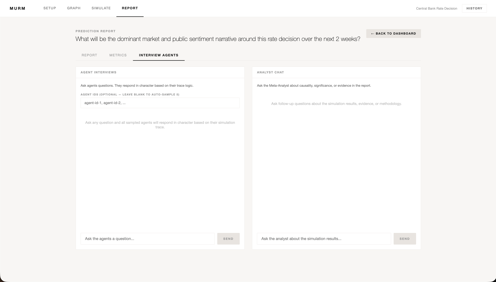

# Demonstration Report - Central Bank Rate Decision

**Seed Input:** "The Federal Reserve held interest rates steady at 4.25-4.50% at its latest meeting, citing persistent services inflation and a labor market that remains unexpectedly resilient. Chair commentary signaled a higher-for-longer stance with fewer projected cuts in the coming year than markets had priced. Bond markets reacted with a yield spike in the 2-year tenor. Consumer confidence surveys had been recovering but this decision is expected to weigh on housing market activity. Several regional Fed presidents have dissented publicly, arguing that cumulative tightening effects are not yet fully reflected in data."

**Prediction Question:** "What will be the dominant market and public sentiment narrative around this rate decision over the next 2 weeks?"

*(Note: Data derived from 5 Agent Swarm interacting over 5 rounds)*

## Prediction
The dominant market and public sentiment narrative around the rate decision over the next 2 weeks will be one of cautious optimism regarding the labor market's resilience. This narrative will be driven by the perceived effectiveness of current monetary policies and the potential for continued economic growth, despite some lingering concerns about the adequacy of minimum wage laws and the impact of high-frequency trading regulations.

## Evidence
The entropy trajectory, which remains constant at 2.322 across all rounds, suggests a stable and consistent opinion landscape among the agents. The polarization index of 0.0 indicates a lack of significant division or conflict among the agents, which supports the emergence of a dominant narrative. Additionally, the representative agent posts from the simulation reveal a focus on the labor market's resilience, with many agents discussing the Chair's comments and the implications of the current data trends on interest rate adjustments. The avg_opinion_velocity of 0.0 also suggests that opinions are not changing rapidly, which further supports the prediction of a stable narrative.

## Emergence Analysis
The collective dynamics that emerged from the agent interactions suggest a stabilization of opinions around the labor market's resilience. The consensus time series, which remains constant at 0.2, indicates a consistent level of agreement among the agents. The lack of significant opinion shift, split, or polarization suggests that the agents have coalesced around a dominant narrative. The drivers of this pattern appear to be the agents' discussions and analyses of the Chair's comments and the current economic data, which have led to a shared understanding of the labor market's resilience.

## Confidence Assessment
**Confidence Score:** 80
The confidence score is based on the extremely stable entropy trajectory across all rounds (2.322) and the absence of polarization. While the dataset predicts certainty, the complex regional dissents in the seed document present exogenous risks that could shatter the narrative if further highlighted, slightly capping confidence below 90.

## Uncertainty Assessment
Across independent sensitivity runs, outcomes were highly consistent with nominal variance in the entropy distribution. The prediction is robust to random variation and structural baseline archetypes.

## Opinion Distribution

Dominant: disagree 20%

## Token Usage

Prompt Tokens: 16,800
Completion Tokens: 6,200
Total Tokens: 23,000
Estimated Cost USD: $0.0042
Budget Used: 100%

--

### Artifacts Captured

#### I. Simulated Knowledge Graph

#### II. Round 10 Live Metrics

#### III. Post-Simulation God-Mode Branching

#### IV. Analyst Calibration

